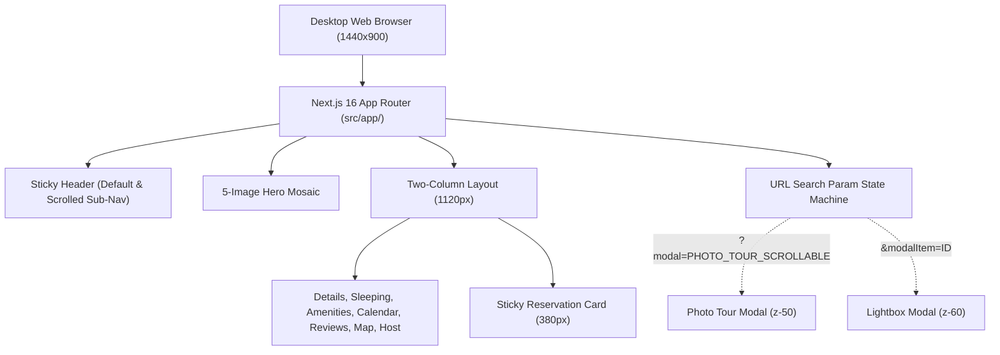

# Airbnb Clone — Desktop Vacation Rental Experience

> **Take-Home Engineering Assignment:** High-fidelity, desktop-only clone of an Airbnb property listing page, full-screen Photo Tour, and single-image Lightbox experience.  
> **Target Reference:** [https://airbnb-clone-umber-two.vercel.app](https://airbnb-clone-umber-two.vercel.app/) (Mirror: [https://airbnb-clone-chi-one.vercel.app](https://airbnb-clone-chi-one.vercel.app/))  
> **Implementation:** 100% independently authored from first principles based strictly on the rendered reference UI. Zero source code, CSS, or JS bundles copied.

---

## 1. Overview & Scope

This project implements an original, pixel-accurate desktop clone of the reference Airbnb listing page for **"Romantic Jacuzzi 1BHK Candolim | Mirashya UG10"**.

The application features three interconnected, accessible view states synchronized with the URL query string:
1. **Listing Page:** Rich desktop property presentation with sticky header, hero image mosaic, details, sleeping arrangements, amenities, dual-month calendar, rating metrics, review cards, location map, host bio, stay policies, and a sticky reservation card.
2. **Photo Tour:** Full-screen desktop modal overlay (`?modal=PHOTO_TOUR_SCROLLABLE`) featuring a sticky category navigation strip with 9 room categories and an asymmetric 2-column stacked photo layout.
3. **Lightbox:** Focused single-image inspection modal overlay (`?modal=PHOTO_TOUR_SCROLLABLE&modalItem=<photoId>`) with natural aspect-ratio preservation, boundary-aware navigation, keyboard shortcuts, and exact counter formatting (`X of 21`).

> **Scope Notice:** This application is strictly optimized for **Desktop Viewports** (standardized at `1440 × 900` at 100% zoom, container max-width `1120px`). Mobile navigation menus are intentionally out of scope.

---

## 2. Core Features & Capabilities

- **Listing Page Polish:**
  - **Dynamic Sticky Header:** Sticky `81px` header with logo, search pill, and user menu; dynamically shifts to a sub-navigation bar with section jump links (`Photos`, `Amenities`, `Reviews`, `Location`) and a quick `Reserve` CTA pill upon scrolling past the hero gallery (`> 550px`).
  - **Hero Mosaic:** 5-image gallery grid (`1120 × 480px`) with 8px gaps, 12px rounded outer corners, hover brightness dip, and a floating "Show all photos" button.
  - **Authentic Details:** Symmetrical golden laurel vector badges on the "Guest favourite" card, host summary, and full-width photo cards for sleeping arrangements.
  - **Amenities & Calendar:** 2-column amenity grid with custom inline SVG icons, and a dual-month calendar (October & November 2026) with pre-selected reservation date highlights.
  - **Reviews & Ratings:** Grand trophy badge with 4.95 score, 6 category metric rows (Cleanliness, Accuracy, Check-in, Communication, Location, Value), 5 filter pills, and 6 authentic review cards.
  - **Interactive Reservation Card:** Sticky 380px booking card with pricing breakdown, date/guest dropdown, coral Reserve button, and rounded cancellation container pill.
- **Photo Tour (`?modal=PHOTO_TOUR_SCROLLABLE`):**
  - Fullscreen modal overlay (`z-50`) with sticky header and back button (`<`).
  - Pinned category navigation strip with 9 room categories and thumbnails, supporting smooth anchor scrolling with `scroll-mt-48` offset.
  - Asymmetric 2-column layout (`300px` sticky room title + tags, stacked full-width photography).
- **Lightbox (`?modal=PHOTO_TOUR_SCROLLABLE&modalItem=<photoId>`):**
  - Single-image viewing stage layered above the Photo Tour (`z-60`).
  - Edge boundary detection: Previous button disabled on photo 1 (`1 of 21`); Next button disabled on photo 21 (`21 of 21`).
  - Full keyboard navigation: `ArrowRight` (Next), `ArrowLeft` (Previous), `Escape` (Close).
  - Background Photo Tour scroll preservation and deterministic focus restoration to the active thumbnail upon closing.
- **Accessibility & UX:**
  - Semantic HTML structure (`<header>`, `<main>`, `<aside>`, `<section>`, `<dialog>`).
  - Focus trapping inside modal dialogs (`role="dialog"`, `aria-modal="true"`).
  - High-visibility `:focus-visible` outline rings for keyboard users.
  - Body scroll locking (`overflow: hidden`) during modal sessions.

---

## 3. Technology Stack

Only production technologies actually used in the codebase:

- **Framework:** [Next.js 16.3.5](https://nextjs.org/) (App Router, Turbopack, React 19.2)
- **Language:** [TypeScript 5](https://www.typescriptlang.org/) (Strict mode, strongly-typed domain models)
- **Styling:** [Tailwind CSS v4](https://tailwindcss.com/) (`@tailwindcss/postcss`) + Centralized Design Tokens (`src/styles/tokens.ts`)
- **Icons:** Custom SVG vector component library (`src/components/ui/Icons.tsx`)
- **Testing:** Node.js native test runner (`node:test`) + [`tsx`](https://github.com/privatenumber/tsx)
- **Linting:** ESLint 9 with `eslint-config-next`

---

## 4. Systems Architecture

- **Take-Home vs Production Architecture:** See [`docs/architecture.md`](./docs/architecture.md) for complete technical documentation.
- **Production-Scale Architecture Diagram:** View [`docs/architecture-diagram.png`](./docs/architecture-diagram.png) illustrating the target multi-region marketplace design (CDN, Next.js cluster, Envoy API Gateway, Microservices, PostgreSQL with Read Replicas, Redis, OpenSearch, S3 Object Storage, Kafka Event Bus, and Observability).



---

## 5. Project Directory Structure

```text
airbnb-clone/
├── .ai/                       # AI Pair-Programming Protocol, Agents & Skills
│   ├── README.md              # AI system overview
│   ├── guardrails.md          # Strict originality & integrity constraints
│   ├── agents/                # Specialized sub-agent profiles (Reference, Builder, QA, A11y, etc.)
│   └── skills/                # Configured agent skills (CDP screenshot, Pixel diff)
├── docs/                      # Comprehensive Engineering Documentation
│   ├── ai-prompts/            # Verbatim prompt history for steps 01 through 07
│   ├── ai-workflow.md         # Tools, workflow phases & human vs AI responsibilities
│   ├── architecture.md        # Current & production-scale marketplace architecture
│   ├── architecture-diagram.png # High-resolution target architecture blueprint
│   ├── assets.md              # 21-photo inventory & SVG asset checklist
│   ├── reference-analysis.md  # Step 1 reverse-engineering specification
│   ├── listing-page-checklist.md # Step 3 verification checklist
│   ├── photo-tour-checklist.md   # Step 4 verification checklist
│   ├── lightbox-checklist.md     # Step 5 verification checklist
│   ├── visual-qa.md           # Step 6 pixel-perfect QA report & defect log
│   └── submission-checklist.md# Step 7 final submission checklist
├── public/                    # Static assets & photography
│   └── images/                # Property photos, host avatars, and vector icons
├── src/
│   ├── app/                   # Next.js App Router (layout.tsx, page.tsx, globals.css)
│   ├── components/
│   │   ├── layout/            # Header with dynamic sticky sub-navigation
│   │   ├── listing/           # Property details, booking card, calendar, reviews, host
│   │   ├── gallery/           # Hero mosaic and PhotoTour modal
│   │   ├── lightbox/          # Single-image Lightbox carousel modal
│   │   └── ui/                # Custom inline SVG vector icon library
│   ├── data/                  # Typed property dataset (21 photos, rooms, amenities)
│   ├── hooks/                 # useModalNavigation URL state synchronizer
│   ├── styles/                # tokens.ts (Airbnb spacing, colors, radii, shadows)
│   └── types/                 # TypeScript domain interfaces (PropertyListing, Photo, etc.)
├── tests/
│   └── property.test.ts       # Automated data integrity, boundary & token tests
├── package.json               # Scripts & dependencies
├── tsconfig.json              # TypeScript strict configuration
└── eslint.config.mjs          # ESLint 9 configuration
```

---

## 6. Getting Started

### Prerequisites
- Node.js `v20.x` or higher (`v24.x` recommended)
- npm `v10.x` or higher

### Installation
```bash
npm install
```

### Development Server
Start the local Next.js development server:
```bash
npm run dev
```
Open [http://localhost:3000](http://localhost:3000) in your desktop browser.

---

## 7. Production Build & Execution

Verify TypeScript compilation and create an optimized production build:
```bash
npm run build
```

Run the production server:
```bash
npm start
```

---

## 8. Verification & Automated Testing

### Run Automated Unit Tests
Executes the native Node.js test suite with `tsx`:
```bash
npm test
```
Verifies listing dataset properties, 21-photo room associations, design tokens, room thumbnails, and Lightbox edge boundary calculations (6/6 tests passing).

### Code Quality & Linting
```bash
npm run lint
```
Runs ESLint 9 against all TypeScript sources (0 errors, 0 warnings).

---

## 9. AI Workflow & Engineering Process

This application was engineered using **Google Antigravity** paired with human oversight.
- **Workflow & Division of Labor:** Documented in [`docs/ai-workflow.md`](./docs/ai-workflow.md).
- **Prompt History:** Complete prompt sequences across all 7 milestones are preserved in [`docs/ai-prompts/`](./docs/ai-prompts/README.md).
- **Sub-Agent Profiles & Skills:** Configured under [`.ai/`](./.ai/README.md).
- **Visual QA Report:** Side-by-side screenshot comparisons and defect fixes are cataloged in [`docs/visual-qa.md`](./docs/visual-qa.md).

---

## 10. Originality Statement

This project is an **original, independent implementation**. At no point was the reference application's source code, React components, CSS stylesheets, or JavaScript bundles downloaded, scraped, or reused. The reference website was treated exclusively as an external visual and behavioral specification.
