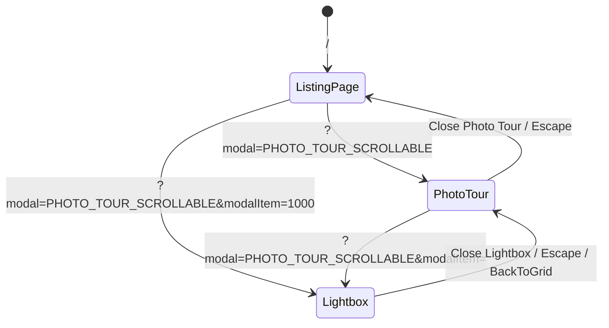

# Architectural Specification & Systems Design Document

> **Project:** Desktop-Only Airbnb Clone Take-Home Assignment  
> **Reference:** [https://airbnb-clone-umber-two.vercel.app](https://airbnb-clone-umber-two.vercel.app/)  
> **Status:** Step 7 — Production Architecture & Engineering Submission Package  
> **Diagram:** [docs/architecture-diagram.png](file:///d:/AI-ML-assements_2026/airbnb-clone/docs/architecture-diagram.png)

---

## 1. Overview & Document Purpose

This document provides a two-part architectural breakdown:
1. **Current Take-Home Architecture:** The actual implemented desktop-only Next.js application, its component topology, client-side state machine, URL synchronization, and design token integration.
2. **Production-Scale Marketplace Architecture:** A comprehensive, distributed system blueprint demonstrating how this vacation-rental marketplace would be designed, scaled, and deployed to support millions of concurrent users, global listings, instant bookings, and resilient media delivery.

---

## 2. Current Take-Home Architecture

The current implementation is an independently built, desktop-only Next.js application focused on high visual fidelity, performance, and accessibility.

### 2.1 Technology Stack

- **Framework:** Next.js 16.3.5 (App Router, Turbopack, React 19.2)
- **Language:** TypeScript 5.0 (Strict mode, explicit domain interfaces)
- **Styling:** Tailwind CSS v4 (`@tailwindcss/postcss`) + Centralized Design Tokens (`src/styles/tokens.ts`)
- **Icons:** Custom SVG component library (`src/components/ui/Icons.tsx`)
- **State & Routing:** Next.js App Router `useSearchParams`, `useRouter`, and React 19 `useTransition`
- **Testing:** Node.js native test runner (`node:test`) + `tsx`
- **Linting:** ESLint 9 (`eslint-config-next/core-web-vitals`, `eslint-config-next/typescript`)

### 2.2 Component Hierarchy & Data Flow

```text
RootLayout (src/app/layout.tsx)
└── Page Shell (src/app/page.tsx)
    ├── Header (src/components/layout/Header.tsx)
    │   ├── Default: 81px sticky bar, search pill, user menu
    │   └── Scrolled (>550px): Dynamic sub-navigation tabs & quick Reserve CTA
    ├── Main Container (max-w-[1120px] mx-auto)
    │   ├── PropertyHeader (Title, Share, Save heart toggle)
    │   ├── PropertyGallery (5-photo hero mosaic, 'Show all photos' action)
    │   └── Two-Column Content Grid (1fr / 380px)
    │       ├── Left Column (650px details):
    │       │   ├── PropertyDetails (Guest favourite laurels, host summary, sleeping cards)
    │       │   ├── Amenities (2-column icon grid, show more action)
    │       │   ├── CalendarSection (Dual-month October/November 2026 picker)
    │       │   ├── ReviewsSection (Grand badge, 6 rating metrics, review cards)
    │       │   ├── LocationMap (Vector styled map card, neighborhood summary)
    │       │   ├── HostSection (Mirashya Homes profile, superhost badge, 8 co-hosts)
    │       │   └── StayPolicies (3-column 'Things to know')
    │       └── Right Column (380px sticky):
    │           └── BookingCard (Sticky card, date/guest picker, cancellation pill, breakdown)
    ├── PhotoTour Modal (src/components/gallery/PhotoTour.tsx)
    │   └── Fullscreen modal (z-50), sticky header & 9-room category strip, 2-column room grid
    └── Lightbox Modal (src/components/lightbox/Lightbox.tsx)
        └── Focused single-image modal (z-60), room title, 'X of 21' counter, boundary disabled buttons
```

### 2.3 URL-Driven Modal State Machine

Instead of ephemeral React component state, the three view states are synchronized deterministically via URL query parameters:



- **Transitions:** Handled via `useModalNavigation` hook using `router.push(url, { scroll: false })` wrapped in `startTransition`.
- **Preservation:** When Lightbox opens, the underlying Photo Tour stays mounted in the background, preserving exact scroll position and room categorization.
- **Accessibility & Focus:** Focus is trapped within modal dialogs (`role="dialog"`, `aria-modal="true"`). Closing modals deterministically restores focus to the opener trigger element or active photo thumbnail.

---

## 3. Production-Scale Marketplace Architecture


The target architecture is a high-availability, distributed microservices platform designed to handle global booking volume, heavy read-to-write ratios (100:1), real-time calendar locks, and multi-region content delivery.

### 3.1 Architecture Overview & Data Flow

```text
[ Client Tier: Desktop Browser / Mobile Apps ]
                    │
                    ▼ HTTPS / TLS 1.3
[ Edge / CDN Tier: Anycast CDN + Edge Image Transcoder (WebP/AVIF) ]
                    │
                    ▼ Cached / Origin Request
[ Web Frontend Tier: Next.js SSR / ISR App Cluster (Containerized) ]
                    │
                    ▼ Internal Ingress / gRPC / REST
[ API Management: API Gateway / Envoy Proxy / Load Balancer ]
                    │
   ┌────────────────┼────────────────┬────────────────┐
   ▼                ▼                ▼                ▼
Listing Service  Booking Service  Payment Service  Search Service
   │                │                │                │
User/Auth Serv.  Review Service   Notif. Service   Tax/Pricing Serv.
   │                │                │                │
   └────────────────┼────────────────┴────────────────┘
                    │
                    ▼ Read/Write Queries & Cache-Aside
[ Data Storage & Caching Tier ]
  ├── PostgreSQL (Primary DB + Multi-AZ Read Replicas + PgBouncer)
  ├── Redis Cluster (Session Cache, Distributed Locks, Rate Limits)
  └── OpenSearch / Elasticsearch Cluster (Geo-Spatial, Facets, Ranking)

[ Asynchronous & Event Streaming ]
  ├── Message Broker (Apache Kafka / AWS SQS / RabbitMQ)
  └── Worker Fleet: Image Processing, Re-Indexing, Notifications, Expiry Handlers

[ External Providers ]
  ├── Payment Gateways: Stripe / Adyen (PCI-compliant tokenization, webhooks)
  └── Communications: SendGrid / Twilio (Transactional emails & SMS)

[ Cross-Cutting: Enterprise Security & Observability ]
  ├── OpenTelemetry, Prometheus, Grafana, ELK Stack, Distributed Traces
  └── Zero Trust, KMS/Vault Secrets, RBAC, WAF, DDoS Mitigation
```

---

### 3.2 Key Production Components

#### 1. Edge & CDN Layer
- **Global Anycast CDN:** Routes traffic to the closest Point of Presence (PoP), terminating TLS connections close to the user, mitigating DDoS attacks, and caching static assets.
- **Edge Image Optimization:** Ingests high-resolution master photography from Object Storage and serves responsive, content-aware WebP/AVIF formats directly from edge caches.

#### 2. Web Frontend Tier (Next.js at Scale)
- **Hybrid Rendering:**
  - **Static Site Generation (SSG) / Incremental Static Regeneration (ISR):** Popular listing details pages are pre-rendered at build time and revalidated in the background every 60 seconds.
  - **Server-Side Rendering (SSR):** Used for authenticated user flows, checkout screens, and dynamic search result pages.
  - **React Server Components (RSC):** Minimizes client JavaScript payload by streaming server-rendered HTML directly to the browser.

#### 3. API Management & Ingress Layer
- **API Gateway (Envoy / Kong):** Acts as the single entry point for all frontend requests. Provides:
  - Centralized JWT verification and session validation.
  - Global token-bucket rate limiting (protecting against scraping and credential stuffing).
  - Dynamic request routing to backend gRPC and REST endpoints.
  - Circuit breaking and retry policies to prevent cascading service degradation.

#### 4. Logical Backend Microservices
- **Listing Service:** Manages property metadata, room taxonomy, amenities, pricing tiers, and host configurations.
- **Booking Service:** Manages reservation state machines (`PENDING`, `HELD`, `CONFIRMED`, `CANCELLED`), calendar date locks, and cancellation policies.
- **Payment Service:** Implements an abstraction layer over external payment providers. Manages authorization holds, capture, host payouts, refunds, and webhook idempotency.
- **Search Service:** Powers multi-attribute discovery including geographic radius bounding boxes, date availability checks, guest counts, and ranking algorithms.
- **User & Auth Service:** Manages guest and host credentials, KYC verification, Superhost badge computations, and permissions.
- **Review Service:** Collects multi-dimensional ratings (Cleanliness, Accuracy, Check-in, Communication, Location, Value), aggregates statistics, and validates review eligibility.
- **Notification Service:** Dispatches transactional email, SMS, and push notifications based on domain events.

---

### 3.3 Database & Storage Architecture

#### 1. Primary Relational Database (PostgreSQL)
A relational model is mandatory to ensure ACID guarantees for financial transactions, reservations, and inventory consistency.

**Core Entities & Relationships:**
- `users`: `(id, email, password_hash, first_name, last_name, avatar_url, is_superhost, created_at)`
- `properties`: `(id, host_id, title, description, property_type, city, country, lat, lng, base_price, max_guests, created_at)`
- `rooms`: `(id, property_id, name, room_type, sort_order)`
- `photos`: `(id, property_id, room_id, url, caption, sort_order)`
- `availability`: `(id, property_id, date, status [AVAILABLE | BLOCKED | RESERVED], price)`
- `reservations`: `(id, property_id, guest_id, check_in, check_out, total_amount, status, created_at)`
- `payments`: `(id, reservation_id, provider, external_id, amount, currency, status, idempotency_key)`
- `reviews`: `(id, reservation_id, property_id, guest_id, cleanliness, accuracy, check_in, communication, location, value, comment, created_at)`

**Scaling Mechanism:**
- Primary write instance with multi-AZ synchronous standby.
- Horizontally scaled read replicas behind PgBouncer connection poolers to serve high-volume read traffic.
- Table partitioning by geographic region or date ranges (e.g., partitioning `availability` and `reservations` by year/month).

#### 2. Distributed Cache (Redis Cluster)
- **Availability Cache:** Bitmaps and Sorted Sets to perform sub-millisecond date conflict lookups before hitting the primary database.
- **Distributed Locking:** Implements the Redlock algorithm to acquire short-lived distributed mutex locks during checkout, eliminating race conditions and double bookings.
- **Search & Session Caching:** Caches high-frequency search facets and user session data with explicit TTLs.

#### 3. Search Cluster (OpenSearch / Elasticsearch)
- Stores de-normalized listing documents containing location coordinates (`geo_point`), active amenities, price ranges, and real-time availability bitmasks.
- Provides sub-50ms query responses for complex spatial and multi-filter discovery.

#### 4. Object Storage & Media Pipeline
- **Storage:** Amazon S3 / Google Cloud Storage for durable, versioned asset storage.
- **Upload Flow:** Client requests a pre-signed S3 upload URL from the Listing Service -> Uploads raw image directly to Object Storage.
- **Processing:** S3 `ObjectCreated` event triggers an asynchronous worker to generate multi-resolution thumbnails, apply compression, and populate CDN caches.

---

### 3.4 Asynchronous Processing & Messaging Layer

- **Message Broker:** Apache Kafka or AWS SQS / RabbitMQ.
- **Domain Event Topics:**
  - `listing.created` / `listing.updated`: Triggers search re-indexing.
  - `booking.requested`: Triggers 15-minute temporary availability hold.
  - `booking.confirmed`: Triggers payment capture, calendar blocking, confirmation emails, and host notifications.
  - `booking.expired`: Releases calendar holds if payment is not completed within 15 minutes.
- **Worker Fleet:** Horizontally auto-scaled stateless worker pods (Kubernetes / ECS) processing queued jobs with dead-letter queue (DLQ) safeguards.

---

### 3.5 Payment Processing & Security Abstraction

- **Provider Abstraction:** The Payment Service wraps external providers (e.g., Stripe, Adyen) behind a unified interface:
  ```typescript
  interface PaymentProvider {
    authorizeHold(amount: Money, token: PaymentToken, idempotencyKey: string): Promise<PaymentHold>;
    capturePayment(holdId: string, idempotencyKey: string): Promise<PaymentReceipt>;
    refundPayment(paymentId: string, amount: Money, reason: string): Promise<RefundReceipt>;
  }
  ```
- **PCI-DSS Compliance:** The marketplace never stores raw credit card details; all sensitive inputs are captured via hosted tokenization iframes (Stripe Elements).
- **Idempotency:** Every checkout request generates a unique idempotency key. Duplicate requests within a 24-hour window return the cached receipt, preventing double charges.
- **Webhooks:** Inbound provider webhooks verify cryptographic signatures, log raw event payloads, and enqueue processing asynchronously.

---

### 3.6 Continuous Delivery & Deployment Pipeline

```text
[ Developer Push / Pull Request ]
               │
               ▼
[ GitHub Actions / GitLab CI ]
  ├── 1. Code Quality: ESLint, TypeScript Strict Check, Prettier
  ├── 2. Automated Tests: Unit tests (node:test), Integration, E2E (Playwright)
  ├── 3. Security Scanning: Snyk, Dependency Audit, Secret Scanning
  └── 4. Artifact Build: Docker container images tagged with commit SHA
               │
               ▼
[ Container Registry (Amazon ECR / Google Artifact Registry) ]
               │
               ▼
[ Deployment Automation (ArgoCD / GitOps) ]
  ├── Staging: Automated deployment & smoke test suite
  └── Production: Canary deployment (5% -> 25% -> 100% traffic shift)
```

- **Frontend:** Deployed to Vercel or an edge-routed AWS ECS/EKS cluster.
- **Backend Services:** Containerized stateless pods running on managed Kubernetes (EKS / GKE) with Horizontal Pod Autoscalers (HPA).
- **Database:** Managed Cloud SQL / AWS Aurora PostgreSQL with automated failover and point-in-time recovery (PITR).

---

## 4. Platform Scaling Strategy

### 4.1 Frontend Scaling
- Static asset offloading via global Anycast CDN PoPs.
- Incremental Static Regeneration (ISR) ensures high-traffic listing pages are rendered once and served as static HTML to 99% of guests.
- Edge middleware handles regional routing and localized currency formatting.

### 4.2 API Tier Scaling
- Stateless backend services scale horizontally based on CPU utilization and request concurrency.
- Aggressive connection pooling (PgBouncer) avoids database connection exhaustion.
- gRPC transport for high-throughput inter-service communication.

### 4.3 Database Scaling
- **Read/Write Splitting:** All mutations route to the Primary PostgreSQL instance; search and read-heavy views query read replicas.
- **Table Partitioning:** Partitioning large transaction logs by date ranges.
- **Purging / Cold Storage:** Archiving historical reservations and logs older than 5 years to S3/Snowflake.

### 4.4 Search Scaling
- Dedicated multi-node OpenSearch clusters with independent index shards and read replicas.
- Asynchronous re-indexing decoupled from transaction write paths.

### 4.5 Image Delivery Scaling
- Original high-res photography resides in private S3 buckets.
- CDN fetches, transcodes, resizes, and caches images at the edge.

### 4.6 Reliability & Fault Tolerance
- **Health Checks & Circuit Breakers:** Services detect failing dependencies and return graceful degradation responses (e.g., serving cached listings if Review Service is slow).
- **Graceful Retries:** Exponential backoff with jitter on transient network errors.
- **Zero-Downtime Deployments:** Rolling canary deployments with automated rollback on error rate spikes.

---

## 5. Security & Observability

### 5.1 Security Boundaries
- **HTTPS & TLS 1.3:** Strict transport security (HSTS) across all client and API boundaries.
- **Authentication & Authorization:** Scoped OAuth2 / JWT access tokens verified at the API Gateway.
- **Zero Trust Network:** Microservices communicate over mutual TLS (mTLS) within a private VPC mesh.
- **Secrets Management:** Cloud KMS / HashiCorp Vault injects secrets at runtime; zero credentials stored in repository.
- **Input Sanitization:** Deep validation of all client payloads to protect against SQL injection, XSS, and parameter tampering.

### 5.2 Observability & Telemetry
- **Distributed Tracing:** OpenTelemetry instrumentation tracing requests from Next.js -> API Gateway -> Microservices -> PostgreSQL.
- **Metrics & Dashboards:** Prometheus collecting system and business metrics (RPS, P99 latency, error rates, booking completion rate), visualized via Grafana.
- **Centralized Logging:** JSON structured logging aggregated via Fluentbit to Elasticsearch/OpenSearch.
- **Synthetic Monitoring:** Automated heartbeat checks simulating the user booking flow every 5 minutes.
